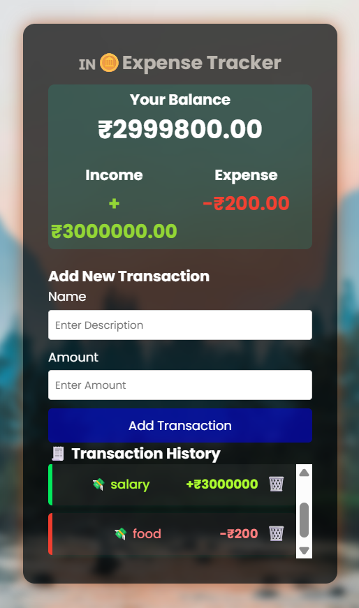

# 💰 Expense Tracker

This is a simple and stylish Expense Tracker web app built using **HTML, CSS, and JavaScript**. It allows you to record your income and expenses, visualize your transactions, and persist data even after refreshing the page using **LocalStorage**.

## 🔥 Features

- Add income and expense entries
- View total balance, income, and expenses
- Delete individual transactions
- Responsive design with animations
- Beautiful background image
- Stores data using LocalStorage
- Logs time and date of each transaction

## 📸 Preview

  <!-- Replace with your actual image name -->
---
📂 Folder Structure

expense-tracker/ 
├── index.html 
├── style.css 
├── script.js 
├── images/ 
│   └── bg.jpg 
└── README.md 

---
✨ Future Enhancements

📊 Pie Chart for expenses (use Chart.js)

🌙 Dark Mode toggle

📆 Filter by date/month

💾 Export to .csv or .pdf

🔒 Password protected mode (JavaScript-based)

🧠 AI Tip (e.g., “You spent more on food this week!”) — optional fun feature
 
??
